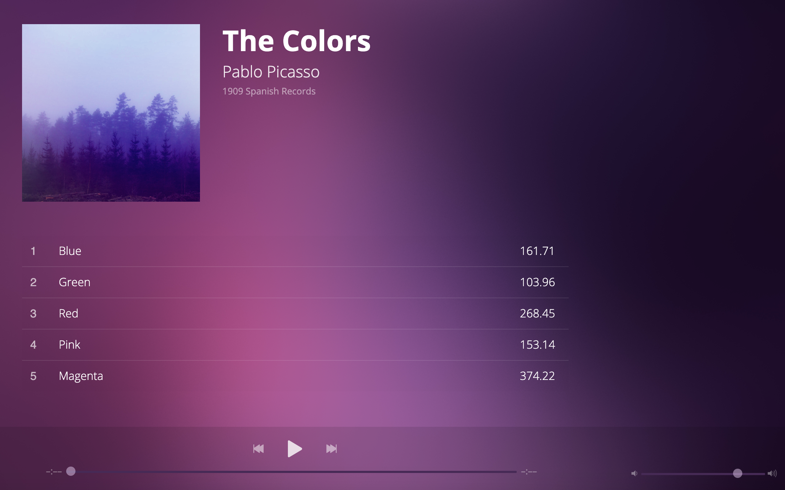

**BlocJams** is a starter project for Bloc's jQuery-driven music player app. 

This project uses:

- jQuery to insert information into the DOM: the Album title and Album art
- jQuery for moving between and playing songs
- jQuery to create a working skip forward and backward buttons
- make Times display in m:ss
- Use jQuery to make slider for volume work
- Use jQuery to make slider play time work
